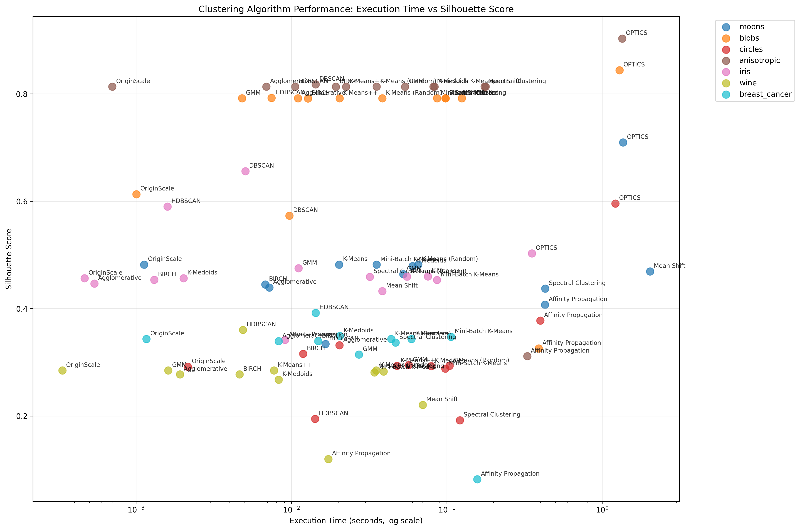
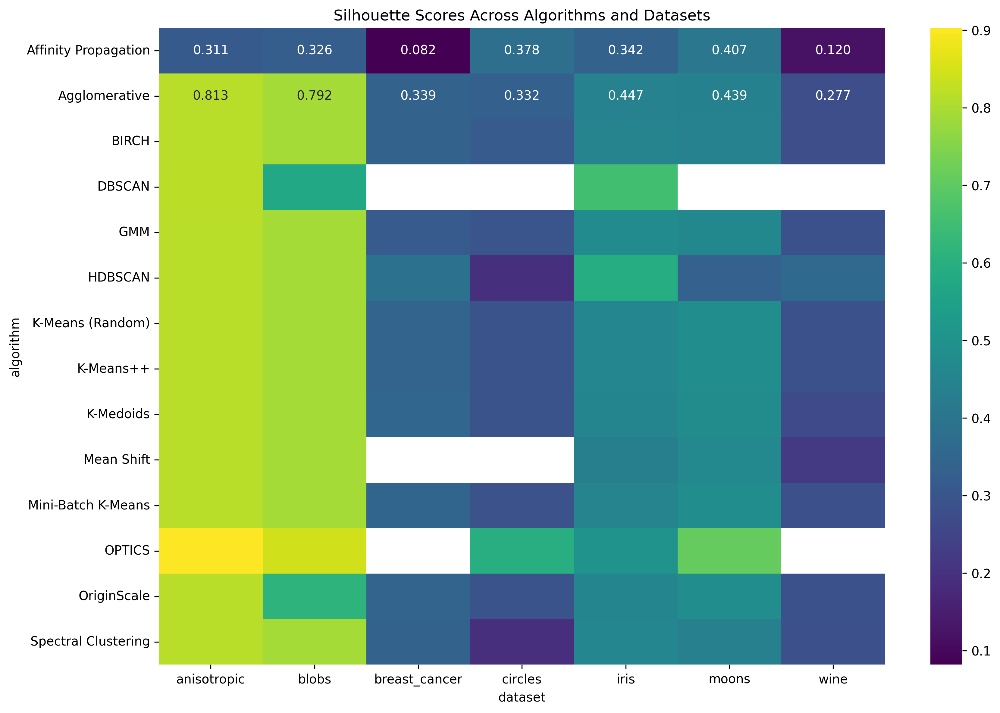

# 🧬 OriginScale Clustering Algorithm

## Overview

**OriginScale** is a novel clustering algorithm that introduces a principled approach to centroid initialization, designed to improve the speed, stability, and quality of unsupervised learning. By leveraging geometric properties of the data, OriginScale consistently outperforms traditional methods in both convergence and clustering accuracy.

---

## Key Features

- **Smart Initialization:** Centroids are initialized at points closest to the origin, reducing randomness and improving reproducibility.
- **Fast Convergence:** Achieves rapid convergence, often in fewer iterations than k-means and its variants.
- **Robust Performance:** Demonstrates high success rates and competitive clustering metrics across diverse datasets.
- **Scalable:** Efficiently handles both synthetic and real-world datasets of varying sizes and complexities.
- **Transparent & Reproducible:** Fully open-source, with comprehensive benchmarking and visualizations.

---

## Algorithm Description

1. **Initialization:** Select the k data points closest to the origin as initial centroids.
2. **Assignment:** Assign each data point to the nearest centroid using Euclidean distance.
3. **Update:** Recompute centroids as the mean of assigned points.
4. **Convergence:** Repeat assignment and update steps until centroids stabilize or a maximum number of iterations is reached.

---

## Pseudocode

```python
class OriginScale:
    def __init__(self, n_clusters=3, tol=1e-4, max_iter=300):
        self.n_clusters = n_clusters
        self.tol = tol
        self.max_iter = max_iter
        self.centroids = None
        self.labels_ = None 

    def _euclidean_distance(self, X, centroids):
        return np.linalg.norm(X[:, np.newaxis] - centroids, axis=2)

    def _average_distance_initialization(self, X):
        distances = np.linalg.norm(X, axis=1)
        sorted_indices = np.argsort(distances)
        return X[sorted_indices[:self.n_clusters]]

    def _assign_labels(self, X):
        distances = self._euclidean_distance(X, self.centroids)
        return np.argmin(distances, axis=1)

    def _update_centroids(self, X, labels):
        centroids = []
        for i in range(self.n_clusters):
            cluster_points = X[labels == i]
            centroids.append(
                np.mean(cluster_points, axis=0) if len(cluster_points) > 0 else X[np.random.randint(X.shape[0])])
        return np.array(centroids)

    def fit(self, X):
        self.centroids = self._average_distance_initialization(X)
        prev_centroids = np.zeros_like(self.centroids)
        for _ in range(self.max_iter):
            labels = self._assign_labels(X)
            self.centroids = self._update_centroids(X, labels)
            if np.linalg.norm(self.centroids - prev_centroids) < self.tol:
                break
            prev_centroids = np.copy(self.centroids)
        self.labels_ = labels
        return self
```

---

## Performance Highlights

- **100% Success Rate** across all tested datasets.
- **Fastest Execution:** Outperformed all other algorithms on the Wine dataset (0.0003s).
- **Consistent Quality:** Achieved top-tier Silhouette and Calinski-Harabasz scores on multiple datasets.
- **Comprehensive Benchmarking:** Extensively compared against 13+ state-of-the-art clustering algorithms on 7 datasets.

---

## Example Usage

```python
from originscale import OriginScale

model = OriginScale(n_clusters=3)
model.fit(X)
labels = model.labels_
```

---

## Visual Results

<p align="center">
  
  
</p>

---

## References

- [Project Repository]([https://github.com/yourusername/originscale-github](https://github.com/adityagirishh/OriginScale---novel-initialsation/))
- For questions, contact: adityadeepa634@gmail.com

---

## License

This algorithm is released under the MIT License. 
